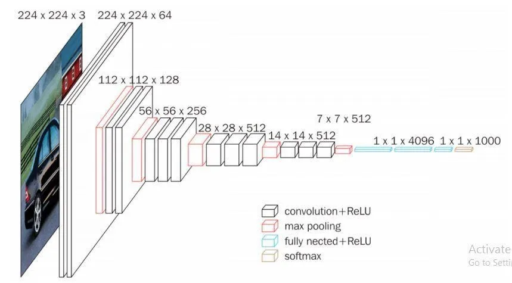

# Week  3 and Week 4 : Still learning Pytorch
##  Using Tensor
Tensor can represent high latitude data structures and be supported by GPU acceleration
##  Containers
``` forward()```

###  Convolution Layers
```Conv2D()```
fliter(IIP)
###  Maxed Pooling Layer
``` MaxPool2D()```
feature extract extraction   (1080p -> 360p)
###  Non-linear Activation

##  Loss Function 
A function that measures the difference between the predicted value```outputs``` and the true value```targets```
  ```L1Loss```  Mean Absolute Error
 ``` MSELoss```Mean Squared Error, or regression tasks
 ```CrossEntropyLoss```  For classification tasks

### Backpropagation
It updates the model parameters by calculating the gradient of the loss function with respect to each parameter. (Like heuristic algorithm in AIM)


##  Try VGG16 architecture


### Load the CIFAR-10 dataset 
```python
train_data = torchvision.datasets.CIFAR10(root='./dataset', train=True, transform = torchvision.transforms.ToTensor(), download=True)  
test_data = torchvision.datasets.CIFAR10(root='./dataset', train=False, transform = torchvision.transforms.ToTensor(), download=True)

train_dataloader = DataLoader(train_data, batch_size=64, shuffle=True)  
test_dataloader = DataLoader(test_data, batch_size=64, shuffle=True)
```

###  Build VGG16 architecture
```python
#创建神经网络  
class Tudui(nn.Module):  
    def __init__(self):  
        super(Tudui, self).__init__()  
        self.model = nn.Sequential(  
            nn.Conv2d(3, 32, kernel_size=5, stride=1, padding=2),  
            nn.MaxPool2d(2),  
            nn.Conv2d(32, 32, kernel_size=5, stride=1, padding=2),  
            nn.MaxPool2d(2),  
            nn.Conv2d(32, 64, kernel_size=5, stride=1, padding=2),  
            nn.MaxPool2d(2),  
            nn.Flatten(),  
            nn.Linear(64 * 4 * 4, 64),  
            nn.Linear(64,10),  
        )  
  
    def forward(self, x):  
        x = self.model(x)  
        return x
```


###  Call gpu
 ``` python
device = torch,device("cuda")
·
·
·
for data in dataloader:
	images, targets = data
	images, targets = images.to(device), targets.to(device) 
·
·
· 
```

###  Save trained model


> Written with [StackEdit](https://stackedit.io/).
