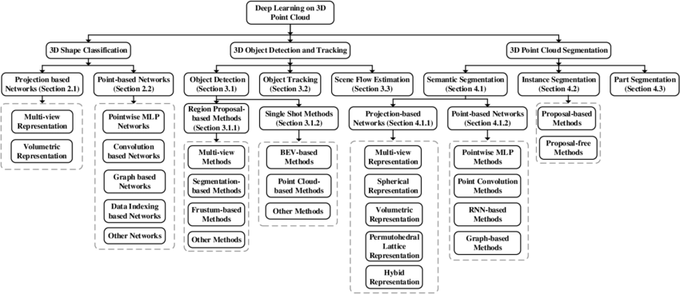
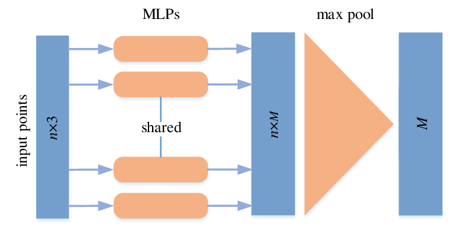
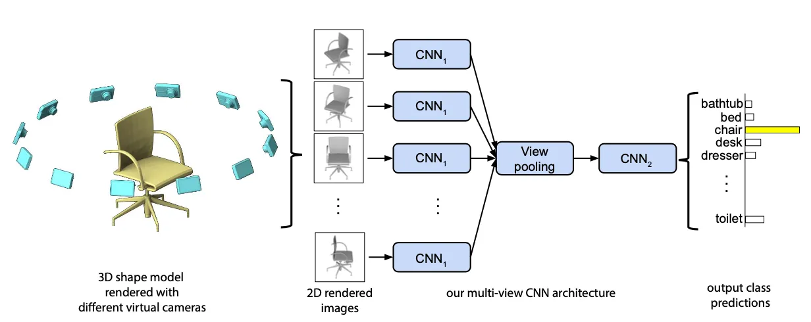
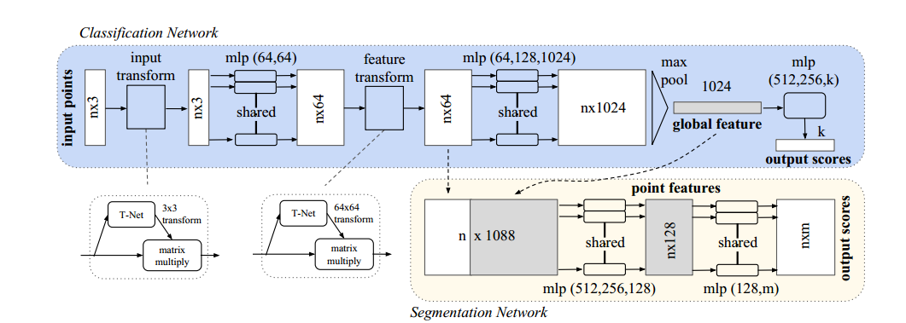
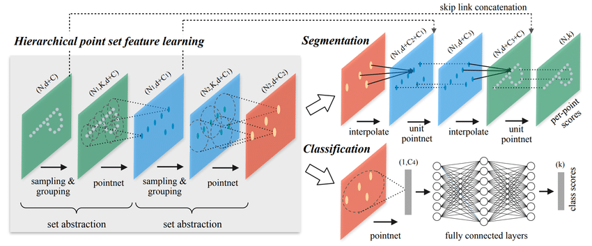

# Week5: Learning point clouds and repruduct pointnet++

## Challenges
- Irregular: dense region and sparse region
- Unstructured
- Unordered

## permutation invariance
The order of the point clouds do not matter, but it matters when the point clouds are represented by a matrix struture.

## Structureed grid
- Voxel based
- multiview based

## In deep learning

### Convolution-based Methods

- 3D neighboring points
- 3D continuous convolution
- 3D discrete convolution
### Graph-based Methods

## PointNet
N orederless points, each represented bu a D-dim vector
 #### Voxerlization
 #### Projection
 Muti-view CNN
 
 #### Feature extraction

### Symmetric function
Symmetric function help the model's output remain consistent regardless of the input order of the points.

### PointNet Classification Network and Segmentation Network

 

 ### 3D CNN vs PointNet
**3D CNN**

Hierarchival feature learning, multiple levels of abstraction

**PointNet**

Global feature learning, either one point or all points, **no local context**

## PointNet++
### PointNet++ overall thinking 
like cnn

**Sample centroids**
- Uniform sampling
- Farthest sampling

**Group points by centroids**
- K nearest neighbors
- Ball query

**Apply PointNet on each point Group**

 

### Deal with Non-uniform point cloud
- Multi-scale grouping(MSG)
- Multi-resolution grouping (MRG)

Recursively apply pointnet at local regions
